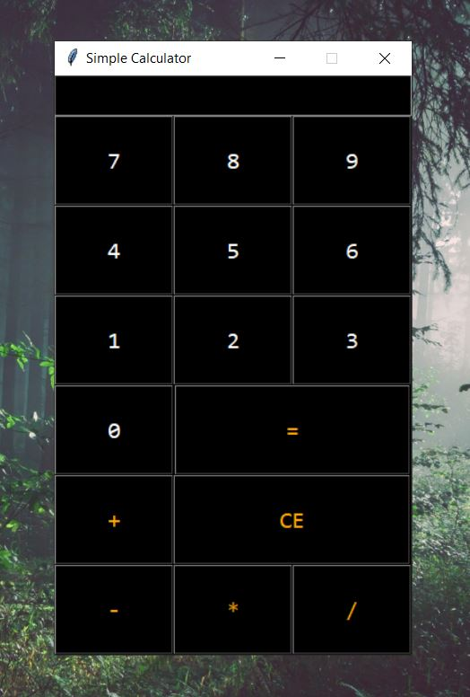

 
 
<!-- PROJECT LOGO -->

  

  <h3 align="center">Simple-Calculator-GUI</h3>

  

    A Simple Calculator GUI made by using python and tkinter package.
     
     
     
    <a href="https://github.com/OmegaCoding5505/Simple-Calculator-GUI/blob/master/Simple%20Calculator.py">View Code</a>
    ·
    <a href="https://github.com/OmegaCoding5505/Simple-Calculator-GUI/issues">Report Bug</a>
    ·
    <a href="https://github.com/OmegaCoding5505/Simple-Calculator-GUI/issues">Request Feature</a>
  

## About The Project
Functions include:
  Operations like Addition, Subtraction, Multiplication and Divison.
